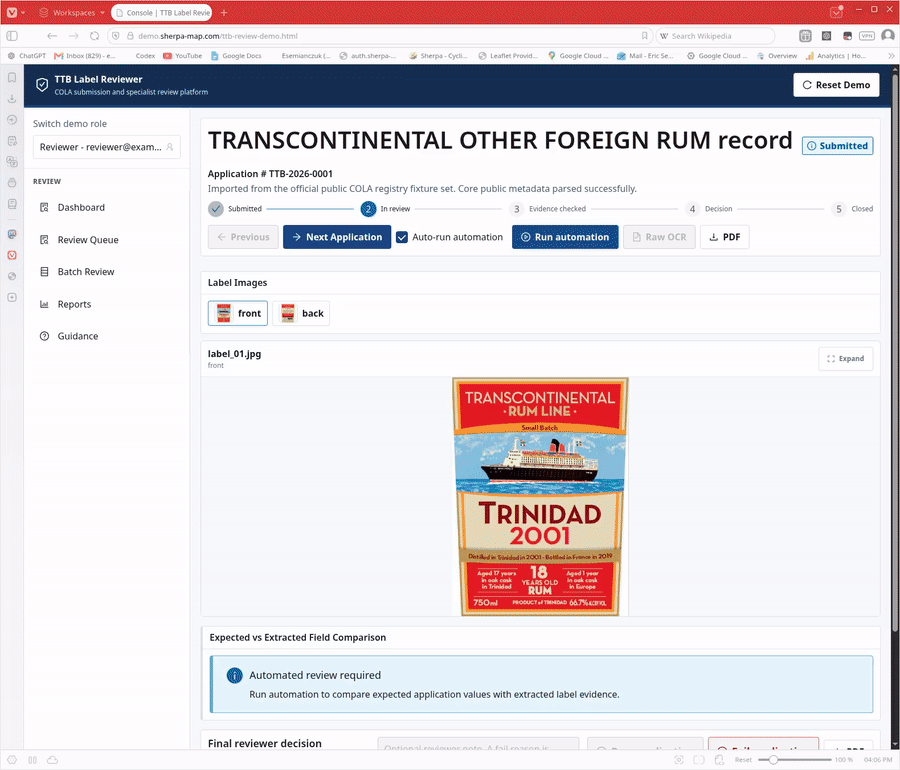
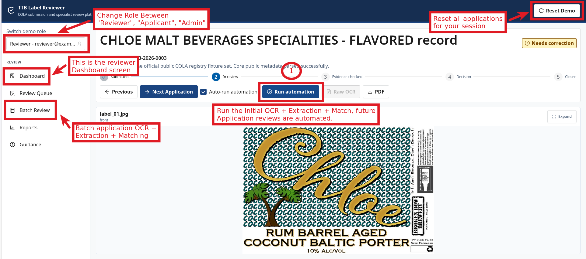
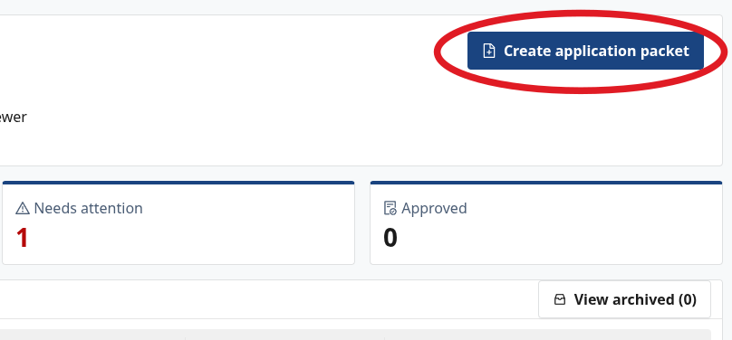
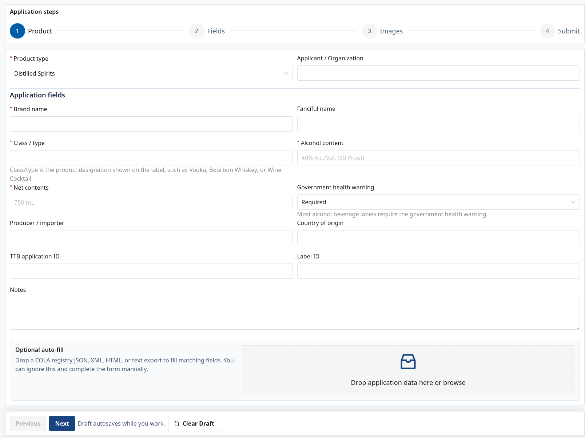

# TTB Label Reviewer



## **Live Demo Link**

**[https://demo.sherpa-map.com/ttb-review-demo.html](https://demo.sherpa-map.com/ttb-review-demo.html)**

## Quickstart Guide



1. Open the live demo or local app and start on the reviewer dashboard.
2. Use **Switch demo role** to move between Reviewer, Applicant, and Admin.
3. Use **Reset Demo** to reset applications, decisions, notes, and review progress for your session.
4. Click **Run automation** on the first application to run OCR, field extraction, matching, and evidence generation.
5. Leave **Auto-run automation** checked to process the next application automatically when moving forward.
6. Use **Batch Review** to select multiple applications and run batch OCR, extraction, and matching.

## Demo Scope

The demo includes a complete role-based access control flow:

- **Reviewer** users process submitted COLA applications, run OCR-backed automation, inspect evidence, override field outcomes, download reports, and close decisions.
- **Applicant** users can create and edit application packets, upload label images, import COLA registry data when available, submit packets, archive records, and respond to correction requests by updating the packet.
- **Admin** users can inspect worker health, OCR engine status, jobs, audit events, benchmarks, settings, and retained fixture state without destructive controls.

The current demo data is built from real public COLA registry records. Collector scripts under `tools/ttb_collector/` were used to pull public detail pages from `ttbonline.gov/colasonline/viewColaDetails.do`, save raw detail HTML, parse application metadata, download printable COLA forms and public label image assets, normalize expected fields, and write the bundled fixture manifests. Earlier prototypes used synthetic AI-generated packets; the current reviewer demo is seeded from the public COLA fixture set.

## Fixture Provenance

All bundled demo records are derived from publicly available approved COLA records. Pending, private, rejected, or in-process applications are not used. Fixture directories retain source identifiers, raw public detail HTML when available, parsed metadata, expected field JSON, manifest rows, and downloaded public label or printable assets so the dataset can be audited against the public source material.

The collector is intentionally small and curated rather than a bulk scraper. It uses known public TTB identifiers, cached discovery helpers, conservative request delays, and a manual promotion step before records are added to the bundled `fixtures/public-cola-registry/records/` dataset.

The repository stores **75 public COLA record directories**, with **66 demo-ready application examples** loaded into the active reviewer queue. The remaining records are retained for provenance and collector validation when their label or metadata evidence is not strong enough for the main demo. Each browser session receives its own seeded demo state, so multiple evaluators can test at the same time. **Reset Demo** clears applications, matches, notes, and review progress for that session only.

Custom examples can be added from the **Applicant** role with **Create application packet**. The applicant form supports manual entry, label-image upload, and optional drag-and-drop import of COLA registry JSON, XML, HTML, or text exports.





TTB Label Reviewer is a local-first assessment project for reviewing alcohol label applications against label-image evidence. It is not an official TTB, Treasury, or legal determination system.

The primary demo path runs everything on the evaluator machine:

```text
FastAPI coordinator -> local PaddleOCR worker -> deterministic TTB validators -> reviewer console
```

If the backend is not reachable, the console falls back to the packaged browser OCR path. No cloud AI service is required.

## Benchmark Snapshot

Hosted reviewer demo, seeded public COLA fixture set. Measured on June 15, 2026 against `https://demo.sherpa-map.com` with isolated benchmark sessions.

| Run mode | Applications | Median review time | p95 review time | Max review time | Backend OCR path | Browser fallback |
|---|---:|---:|---:|---:|---|---:|
| Single reviewer automation | 5 | 4.15 sec | 4.43 sec | 4.43 sec | PaddleOCR CUDA worker | 0 |
| Batch review workflow | 5 | 3.57 sec/app | 4.73 sec/app | 4.73 sec/app | PaddleOCR CUDA worker | 0 |

This hosted run exercised 10 backend review POSTs, 50 evaluated fields, and 26 evidence crops. The active worker reported `paddleocr_cuda_pretrained` on an NVIDIA GeForce RTX 4090. The benchmark measures the full backend automation run from reviewer request to stored review result, including queue/scheduler overhead, worker claim, asset loading, PaddleOCR, field alignment, deterministic validation, evidence box generation, database write, and polling until the completed result is returned. It does not include PDF export time or manual reviewer decision time. Browser-only fallback remained available but was not used. These numbers apply to the tested seeded examples, not every possible COLA label.

The benchmark above is the short evaluator-facing snapshot. The full ML approach, including OCR engine comparisons, corpus coverage, LayoutLMv3 trial results, false-pass gating, and reproduction commands, is documented in [`docs/ML_APPROACH_EVALUATION.md`](docs/ML_APPROACH_EVALUATION.md).

Reproduce the hosted snapshot with:

```bash
source ~/.nvm/nvm.sh 2>/dev/null || true
nvm use 20 2>/dev/null || true
node scripts/benchmark-hosted-reviewer.mjs --singleCount 5 --batchCount 5
```

The take-home prompt describes a prior pilot at roughly 30 to 40 seconds per label. The tested hosted path completes these seeded reviewer automation runs under five seconds at p95 while keeping OCR as evidence only. Deterministic validators and reviewer decisions remain the pass/fail authority.

## What Runs

- **Console**: React/Refine reviewer, applicant, and admin UI served by FastAPI in backend mode.
- **API**: FastAPI coordinator with SQLite demo persistence, uploads, jobs, workers, audit, reports, and static console serving.
- **Worker**: local PaddleOCR worker. It runs full-image OCR, aligns recognized text to expected TTB fields, and returns evidence boxes/crops.
- **Validators**: deterministic validation remains the pass/fail authority. OCR is evidence, not the final decision.
- **Fallback**: browser-only Tesseract OCR with packaged assets when the backend is absent.

## Recommended Setup

Use Docker if the machine has Docker available:

```bash
git clone https://github.com/Esemianczuk/ttb-label-reviewer.git
cd ttb-label-reviewer
./scripts/docker-demo.sh
```

Open:

```text
http://127.0.0.1:8000/
```

The launcher builds the console, starts the API, seeds the public COLA demo records, and starts one PaddleOCR worker. On Linux it auto-detects NVIDIA Docker GPU passthrough and uses the CUDA worker when available. Otherwise it uses CPU.

For a native non-Docker setup:

```bash
git clone https://github.com/Esemianczuk/ttb-label-reviewer.git
cd ttb-label-reviewer
./scripts/smart-demo.sh
```

That command creates `.venv`, installs Python runtime dependencies, installs frontend dependencies if needed, builds the console, starts FastAPI, registers a worker, and streams logs in the terminal. Press `Ctrl+C` to stop it cleanly.

Run a setup check at any time:

```bash
./scripts/doctor.sh
```

## Platform Requirements

### Required Everywhere

- Git
- Python 3.10 or newer, with Python 3.11 or 3.12 preferred
- Node.js 20 or newer for frontend builds
- npm

### Linux Native

Install common image/OCR runtime libraries:

```bash
sudo apt-get update
sudo apt-get install -y git python3 python3-venv python3-pip \
  libgl1 libglib2.0-0 libgomp1 libjpeg-turbo8 libpng16-16 libsm6 libxext6 libxrender1
```

Install Node 20. `nvm` is the least surprising path on Ubuntu because distro packages often provide an older Node:

```bash
curl -fsSL https://raw.githubusercontent.com/nvm-sh/nvm/v0.40.1/install.sh | bash
source ~/.nvm/nvm.sh
nvm install 20
nvm use 20
```

Then run:

```bash
./scripts/smart-demo.sh
```

### macOS Native

Install Homebrew packages:

```bash
brew install git python@3.12 node
```

Then run:

```bash
./scripts/smart-demo.sh
```

PaddleOCR on macOS runs through the available PaddlePaddle runtime and falls back to CPU when a compatible accelerator is not available. Docker Desktop runs Linux containers, so Apple Metal is not exposed to Linux containers. The macOS Docker helper therefore runs the API in Docker and the OCR worker natively:

```bash
./scripts/docker-mac-metal.sh
```

The current shipped OCR path does not require a custom Metal model. The reliable macOS path is native PaddleOCR with CPU fallback.

### Linux CUDA

The easiest CUDA path is Docker:

```bash
./scripts/docker-demo.sh
```

The launcher checks Docker GPU passthrough with an NVIDIA CUDA container. To force CUDA:

```bash
TTB_DOCKER_ACCELERATOR=cuda ./scripts/docker-demo.sh
```

Host requirements:

- NVIDIA driver installed
- Docker Engine or Docker Desktop with Compose v2
- NVIDIA Container Toolkit configured
- This command works:

```bash
docker run --rm --gpus all --entrypoint nvidia-smi nvidia/cuda:12.6.3-cudnn-runtime-ubuntu22.04
```

Native Linux CUDA is available for advanced users:

```bash
python3 -m venv .venv
source .venv/bin/activate
python -m pip install --upgrade pip
python -m pip install -r requirements-cuda-cu126.txt
TTB_PADDLE_RUNTIME=cuda ./scripts/smart-demo.sh
```

Docker CUDA is the reproducible path and is the one expected for evaluator machines with an RTX GPU.

## Docker

Start the default Docker stack:

```bash
./scripts/docker-demo.sh
```

Force CPU:

```bash
TTB_DOCKER_ACCELERATOR=cpu ./scripts/docker-demo.sh
```

Force CUDA:

```bash
TTB_DOCKER_ACCELERATOR=cuda ./scripts/docker-demo.sh
```

Use another port:

```bash
TTB_DOCKER_API_PORT=8010 ./scripts/docker-demo.sh
```

Reset containers and demo data:

```bash
docker compose down -v
```

The Docker images are built locally from `docker/api.Dockerfile`, `docker/worker.Dockerfile`, and `docker/worker-cuda.Dockerfile`. They are tagged as:

```text
ttb-label-reviewer-api:local
ttb-label-reviewer-worker:local
ttb-label-reviewer-worker-cuda:local
```

These images can also be published to GitHub Container Registry by a repository owner using `.github/workflows/docker-images.yml`. Local builds are the default so the demo remains reproducible from a fresh clone even when no package registry credentials are available.

More detail is in [docs/DOCKER.md](docs/DOCKER.md).

## Native Python Setup

The one-command native path is:

```bash
./scripts/smart-demo.sh
```

Manual setup is also supported:

```bash
python3 -m venv .venv
source .venv/bin/activate
python -m pip install --upgrade pip
python -m pip install -r requirements.txt
npm install
npm run console:build
```

Start the backend:

```bash
./scripts/dev-local-backend.sh
```

In a second terminal, mint a join token and start the worker:

```bash
source .venv/bin/activate

ADMIN_TOKEN="$(curl -sS -X POST http://127.0.0.1:8000/api/auth/demo-login \
  -H "Content-Type: application/json" \
  -d '{"role":"admin"}' | python -c 'import json,sys; print(json.load(sys.stdin)["token"])')"

JOIN_TOKEN="$(curl -sS -X POST http://127.0.0.1:8000/api/workers/join-token \
  -H "Authorization: Bearer $ADMIN_TOKEN" \
  -H "Content-Type: application/json" \
  -d '{"ttlSeconds":900}' | python -c 'import json,sys; print(json.load(sys.stdin)["token"])')"

TTB_WORKER_JOIN_TOKEN="$JOIN_TOKEN" ./scripts/dev-worker.sh
```

For development and tests:

```bash
./scripts/setup-dev.sh
```

To make the development environment OCR-capable as well:

```bash
TTB_INSTALL_OCR=1 ./scripts/setup-dev.sh
```

## OCR Models

No custom model weights are committed or required.

The shipped backend uses PaddleOCR 3.2 with PaddlePaddle 3.2.2:

- `paddleocr==3.2.0`
- `paddlex==3.2.0`
- `paddlepaddle==3.2.2` for CPU
- `paddlepaddle-gpu==3.2.2` for the CUDA 12.6 Docker/native path

PaddleOCR downloads its pretrained English OCR assets on first use and caches them:

- Docker CPU/CUDA worker cache: Docker named volumes
- Native local cache: the normal Paddle/PaddleX user cache
- Worker runtime cache: `.worker-cache`

Optional exported PaddleOCR model directories can be staged under:

```text
models/ocr/paddle-cola/current/
  det/
  rec/
  cls/
```

The current production path does not depend on those directories. If they are absent, the worker uses the pretrained PaddleOCR baseline. See [models/ocr/paddle-cola/README.md](models/ocr/paddle-cola/README.md).

The model/method comparison and current fixture statistics are documented in [docs/ML_APPROACH_EVALUATION.md](docs/ML_APPROACH_EVALUATION.md). In short, earlier Tesseract crop, EasyOCR, docTR, TrOCR, CLIP-style ranking, and LayoutLMv3 experiments were evaluated, but the shipped path is PaddleOCR full-image OCR plus conservative field alignment because it provides auditable evidence boxes while deterministic validators remain the pass/fail authority.

## Browser-Only Fallback

Use this only when testing offline frontend behavior without a backend:

```bash
npm install
npm run console:dev
```

Open the Vite URL, usually:

```text
http://127.0.0.1:5174/
```

Browser mode uses packaged Tesseract assets. It does not upload images to a backend. The production browser path has no runtime CDN dependency. A development CDN fallback exists only when explicitly enabled:

```bash
VITE_ALLOW_TESSERACT_CDN_FALLBACK=1 npm run console:dev
```

## Demo Workflow

1. Open `http://127.0.0.1:8000/`.
2. Continue as **Reviewer**.
3. Open the current application from the dashboard or review queue.
4. Click **Run automation** if the packet has not run yet.
5. Compare **Application value** to **Label evidence** in the field table.
6. Expand the label image when needed.
7. Toggle fields or the final application decision between **Pass** and **Fail**.
8. Add reviewer notes when useful.
9. Download the PDF report.
10. Use **Next Application** to continue or **Reset Demo** to restore the examples.

Applicant and Admin roles are available from the left-side role switcher. Each browser session receives isolated demo state so several reviewers can test against the same backend without sharing each other’s review decisions.

## Verification

After setup:

```bash
source ~/.nvm/nvm.sh 2>/dev/null || true
nvm use 20 2>/dev/null || true
source .venv/bin/activate
npm run test:js
python -m pytest -q
npm run build
```

Full check script:

```bash
./scripts/check-all.sh
```

Playwright E2E is opt-in:

```bash
RUN_E2E=1 ./scripts/check-all.sh
```

Benchmark:

```bash
./scripts/bench-local.sh
```

Results are written to `benchmarks/results/latest.json` and shown under Admin -> Benchmarks.

## Troubleshooting

### `npm` fails with `Cannot find module 'node:path'`

An old system Node is being used. Use Node 20:

```bash
source ~/.nvm/nvm.sh
nvm install 20
nvm use 20
```

### Port 8000 is already in use

Use another port:

```bash
TTB_API_PORT=8010 ./scripts/smart-demo.sh
```

For Docker:

```bash
TTB_DOCKER_API_PORT=8010 ./scripts/docker-demo.sh
```

### PaddleOCR install is slow

First install can take several minutes because PaddleOCR and PaddlePaddle wheels are large. Later runs reuse `.venv` or Docker volumes.

### PaddleOCR fails on macOS

Use Python 3.11 or 3.12:

```bash
brew install python@3.12
rm -rf .venv
PYTHON_BIN="$(brew --prefix)/bin/python3.12" ./scripts/smart-demo.sh
```

If Docker is available, use:

```bash
./scripts/docker-mac-metal.sh
```

### Linux CUDA starts as CPU

Check Docker GPU passthrough:

```bash
docker run --rm --gpus all --entrypoint nvidia-smi nvidia/cuda:12.6.3-cudnn-runtime-ubuntu22.04
```

If that fails, repair the NVIDIA Container Toolkit setup or force CPU:

```bash
TTB_DOCKER_ACCELERATOR=cpu ./scripts/docker-demo.sh
```

### Worker cannot register

The worker uses a persistent secret after first registration. If local demo state is stale:

```bash
rm -f .worker-cache/worker-secret.txt
./scripts/smart-demo.sh
```

For Docker:

```bash
docker compose down -v
./scripts/docker-demo.sh
```

### Browser falls back to browser-only mode

The backend is not reachable from the console. Start the backend-served demo:

```bash
./scripts/smart-demo.sh
```

Then open:

```text
http://127.0.0.1:8000/
```

## Repository Layout

```text
apps/api/                      FastAPI coordinator
apps/console/                  reviewer/applicant/admin console
apps/worker/                   PaddleOCR worker
browser-demo/                  packaged browser OCR fallback
docker/                        API and worker container definitions
docs/                          evaluator, architecture, and operations docs
fixtures/public-cola-registry/ public COLA fixture records
models/ocr/paddle-cola/        optional local PaddleOCR model staging path
packages/shared/               shared schemas and golden fixtures
scripts/                       setup, launch, benchmark, and check scripts
tools/                         COLA collector and fixture tools
ttb_validation/                deterministic validation package
```

## More Documentation

- [Evaluator guide](docs/EVALUATOR_GUIDE.md)
- [Architecture](docs/ARCHITECTURE.md)
- [Role model](docs/ROLE_MODEL.md)
- [Security model](docs/SECURITY_MODEL.md)
- [Applicant workflow](docs/APPLICANT_WORKFLOW.md)
- [Reviewer workbench](docs/REVIEWER_WORKBENCH.md)
- [Admin operations](docs/ADMIN_OPERATIONS.md)
- [Docker quick start](docs/DOCKER.md)
- [Deployment](docs/DEPLOYMENT.md)
- [Benchmarks](docs/BENCHMARKS.md)
- [Fixtures](docs/FIXTURES.md)
- [Known limitations](docs/Known_LIMITATIONS.md)
