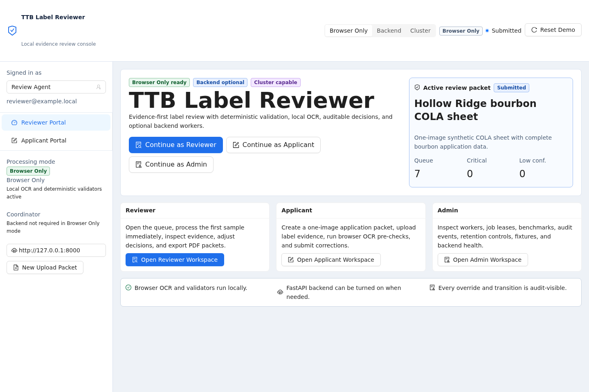
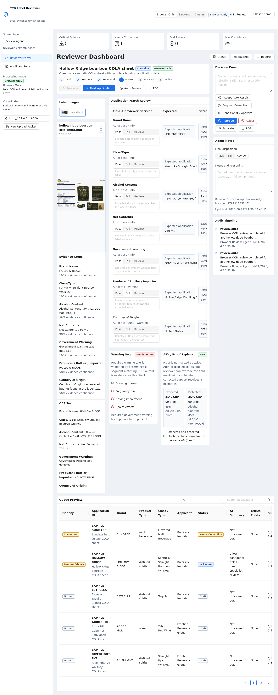
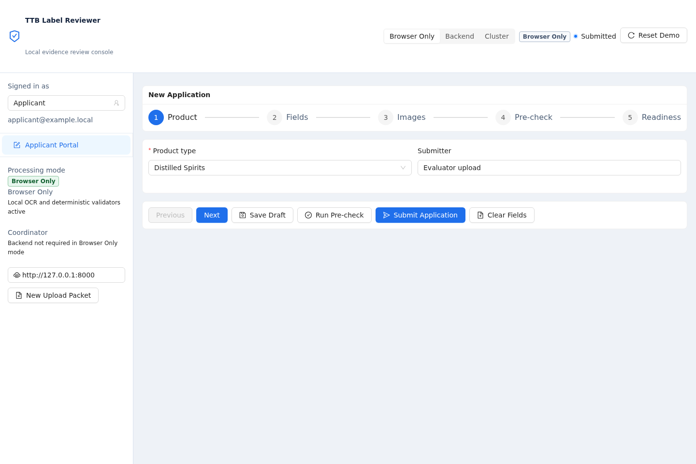
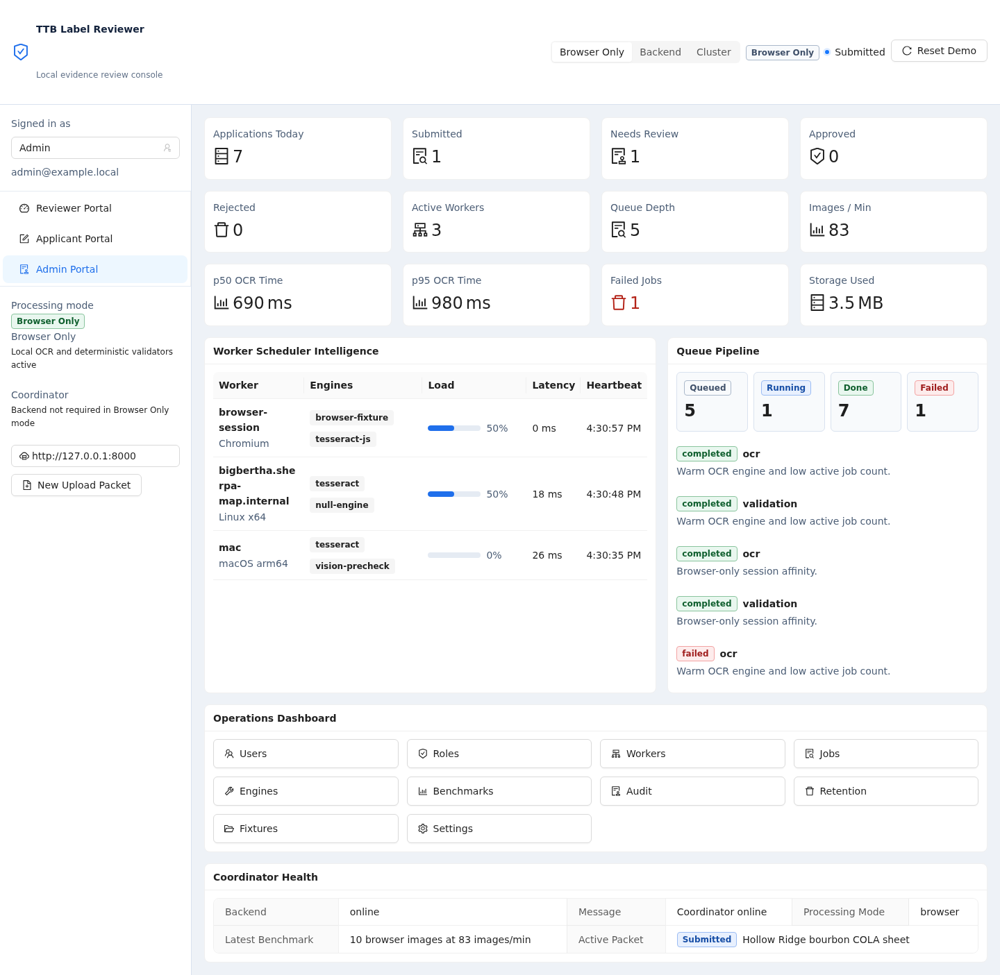

# Evaluator Guide

TTB Label Reviewer is a local-first assessment prototype for comparing TTB/COLA-style application fields with label-image evidence. It is not an official TTB or Treasury system, and it does not make legal determinations.

No cloud AI service is required. Browser Only mode runs in the browser with packaged OCR assets and deterministic validators. Backend and Cluster modes are optional for evaluating the coordinator and worker architecture.

## Screenshots

The repository includes current console screenshots for the main evaluator surfaces:






## Fastest Path

From the repository root:

Requires Node 20 or newer. If your shell uses nvm, run `source ~/.nvm/nvm.sh && nvm use 20` first. The setup and check scripts also activate nvm automatically when it is installed.

For the least manual path, run the terminal launcher:

```bash
./scripts/smart-demo.sh
```

This sets up missing dependencies if needed, starts the FastAPI backend, issues a worker join token, starts one local worker, and opens the backend-served console. Use `./scripts/smart-demo.sh --install-heavy-ocr` on a capable machine when you want the optional PaddleOCR/EasyOCR worker stack installed too.

For a menu-driven version of the same flow, run `python scripts/ttb_launcher.py` and choose `One-click local demo`. The launcher is plain standard-library Python, so it works over SSH and on headless machines. It writes process logs to `logs/launcher/` and only stops processes it started.

Manual browser-only path:

```bash
npm install
npm run console:dev
```

Open the Vite URL printed by the console, normally:

```text
http://127.0.0.1:5174/
```

What to click:

1. Click `Continue as Reviewer`.
2. Confirm the reviewer dashboard opens with the role switcher and `Reset Demo` visible in the shell.
3. Open `Review Queue`.
4. Open `TRANSCONTINENTAL OTHER FOREIGN RUM record`.
5. Click `Run automation` if no automated findings are present.
6. Confirm `Expected vs Extracted Field Comparison` has field rows and evidence snippets.
7. Click `Next Application` to open the next reviewable packet.
8. Confirm missing public-registry values, such as alcohol content or net contents, are clearly marked for review instead of being invented.
9. Use the field decision controls to change a field to `Pass` or `Fail`; notes are available but not required for field toggles.
10. Type decision rationale in the reviewer note panel.
11. Click `PDF` to download the packet report.
12. Click `Expand image viewer`, then use zoom buttons and drag the image to pan.
13. Use `Reset Demo` from the header to restore the sample queue, decisions, notes, and first packet position.

Expected outcome:

- The first page is usable without a tutorial.
- Automated review runs only after an explicit reviewer/applicant action.
- `Next Application` advances to the next reviewable packet.
- Going back preserves the previous reviewer reasoning.
- PDF export includes the submitted fields, image evidence, matches, status, reasons, and notes.
- Uploaded or sample images do not leave the browser in Browser Only mode.

## Browser Only

Browser Only is the default evaluator path. It uses the console snapshot store, packaged Tesseract assets, local OCR fixtures for bundled samples, browser OCR for uploads, and the shared JavaScript validators.

What to click for an upload test:

1. In the left `Signed in as` selector, choose `Applicant`.
2. Open `Applicant Portal`.
3. Click `New Application`.
4. Drop or select a public COLA `metadata.json`, `expected.json`, printable HTML, XML, or text export, or fill the fields manually.
5. Fill any fields highlighted as `Needs attention`.
6. Upload one label image for the typical application path. The wizard also accepts up to 10 images for multi-image packet testing.
7. Continue to `Submit`.
8. Click `Submit for Review` once required fields and at least one image are present.
9. Switch `Signed in as` back to `Review Agent` and open the submitted packet from the queue.

Expected outcome:

- Browser-only reviewer auto-review runs real local OCR/validators rather than fake-only reviews.
- The image blob stays in the browser session.
- The reviewer can modify field pass/fail decisions and notes after automated review.

The production browser and console builds use files under `browser-demo/public/tesseract`. The CDN fallback is disabled by default. For development-only fallback, explicitly set:

```bash
VITE_ALLOW_TESSERACT_CDN_FALLBACK=1 npm run console:dev
```

## Backend Mode

Use Backend mode when you want FastAPI persistence, local asset storage, backend health display, live WebSocket resource updates, admin endpoints, and worker/job APIs.

Set up the full local environment once:

```bash
./scripts/setup-dev.sh
```

Start the coordinator:

```bash
./scripts/dev-local-backend.sh
```

The script prints the API health URL and, when a console build exists, the served console URL. Defaults:

```text
Backend API: http://127.0.0.1:8000/api/health
Console:     http://127.0.0.1:8000/
```

In a separate terminal, issue a join token and start a worker:

```bash
ADMIN_TOKEN="$(curl -sS -X POST http://127.0.0.1:8000/api/auth/demo-login \
  -H "Content-Type: application/json" \
  -d '{"role":"admin"}' | python -c 'import json,sys; print(json.load(sys.stdin)["token"])')"

JOIN_TOKEN="$(curl -sS -X POST http://127.0.0.1:8000/api/cluster/join-token \
  -H "Authorization: Bearer $ADMIN_TOKEN" \
  -H "Content-Type: application/json" \
  -d '{"ttlSeconds":900}' | python -c 'import json,sys; print(json.load(sys.stdin)["token"])')"

TTB_WORKER_JOIN_TOKEN="$JOIN_TOKEN" ./scripts/dev-worker.sh --session-id local-dev-session
```

What to click:

1. Open the console.
2. Switch `Processing mode` to `Backend`.
3. Confirm the header shows `Backend Online` or `Backend Online API Only`.
4. Review a sample or create an applicant packet.
5. Open `Admin Portal`, then `Workers`, `Jobs`, `Audit`, or `Benchmarks`.

Expected outcome:

- `/api/health` reports database, asset root, static readiness, and LAN warnings when applicable.
- The console header displays backend health.
- Review queue, worker heartbeat, job status, and audit rows update without manual refresh.
- If the backend is unavailable, the console offers `Use Browser Only`.

## Cluster Mode

Cluster mode uses the same coordinator API as Backend mode while emphasizing distributed workers and scheduler decisions.

Coordinator terminal:

```bash
TTB_API_HOST=0.0.0.0 \
TTB_API_CORS_ORIGINS=http://127.0.0.1:5174,http://<coordinator-lan-ip>:8000 \
./scripts/dev-local-backend.sh
```

Only use LAN mode on a trusted network. The script and console show a prominent LAN warning when the API binds to `0.0.0.0` or `::`.

Worker terminal on any reachable machine:

```bash
TTB_WORKER_COORDINATOR=http://<coordinator-lan-ip>:8000 \
TTB_WORKER_JOIN_TOKEN="$JOIN_TOKEN" \
./scripts/dev-worker.sh --session-id local-dev-session
```

The worker uses `auto` engine selection by default. PaddleOCR is the preferred backend OCR path on machines where the optional dependency is installed, and EasyOCR remains available as a fallback:

```bash
python -m pip install -e "apps/worker[ocr,paddleocr,easyocr]"
TTB_WORKER_ENGINES=auto ./scripts/dev-worker.sh --session-id local-dev-session
```

Backend and Cluster reviews create OCR jobs before validation. That lets one application fan out across workers instead of serializing every OCR pass on one machine. Critical fields such as the government warning, class/type, ABV, net contents, and brand prefer PaddleOCR-capable workers, using exported custom COLA model dirs when staged. The final validation step aggregates the completed OCR output and applies deterministic validators.

Optional lab hosts, if reachable from your network:

```bash
ssh eric@bigbertha.sherpa-map.internal
ssh eric@thevault.sherpa-map.internal
ssh mac
```

On each host, sync or clone the repo, install dependencies, then run the worker command above with the coordinator LAN URL and the same short-lived join token.

What to click:

1. Switch `Processing mode` to `Cluster`.
2. Open `Admin Portal`.
3. Open `Workers` to see heartbeat, active jobs, engines, and worker controls.
4. Open `Jobs` to see queue status and scheduler reason strings.
5. Run `Auto Review` or submit an applicant packet.

Expected outcome:

- Workers require a join token for first registration.
- Registered workers use a persistent worker secret for heartbeat, claim, complete, and fail calls.
- Stale workers are marked lost.
- Unauthenticated job claims are denied and audited.
- Cluster benchmarks are skipped rather than failed when no eligible workers are available.

## Verification

Core checks:

```bash
npm run test:js
python -m pytest -q
npm run build
```

Full local matrix after Playwright install:

```bash
RUN_E2E=1 ./scripts/check-all.sh
```

Benchmarks:

```bash
./scripts/bench-local.sh
./scripts/bench-cluster.sh
```

Expected files:

- Benchmark JSON is saved under `benchmarks/results`.
- `benchmarks/results/latest.json` points to the newest suite.
- Cluster runs record `skipped` when no backend workers are available.

## Troubleshooting

- If npm fails with `Cannot find module 'node:path'`, your shell is running an old `node` binary with a newer npm. Run `source ~/.nvm/nvm.sh && nvm use 20`, or install Node 20+, then rerun the command.
- If `npm run console:dev` cannot find Vite, run `npm install --prefix apps/console` or rerun `npm install` from the root after the workspace metadata is present.
- If Browser OCR is slow, use one image first and set `Browser OCR workers` to `1`.
- If Backend mode says unavailable, keep reviewing in Browser Only or start `./scripts/dev-local-backend.sh`.
- If a worker cannot register, issue a fresh join token. Tokens are intentionally short-lived.
- If LAN mode is enabled, set exact `TTB_API_CORS_ORIGINS` and keep the network trusted.

Known gaps and honest boundaries are listed in [Known_LIMITATIONS.md](Known_LIMITATIONS.md).
